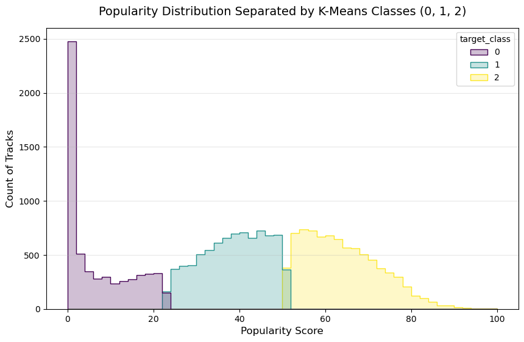
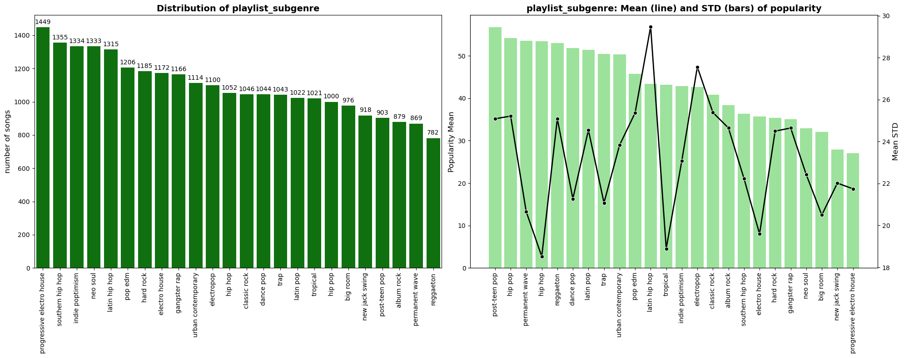
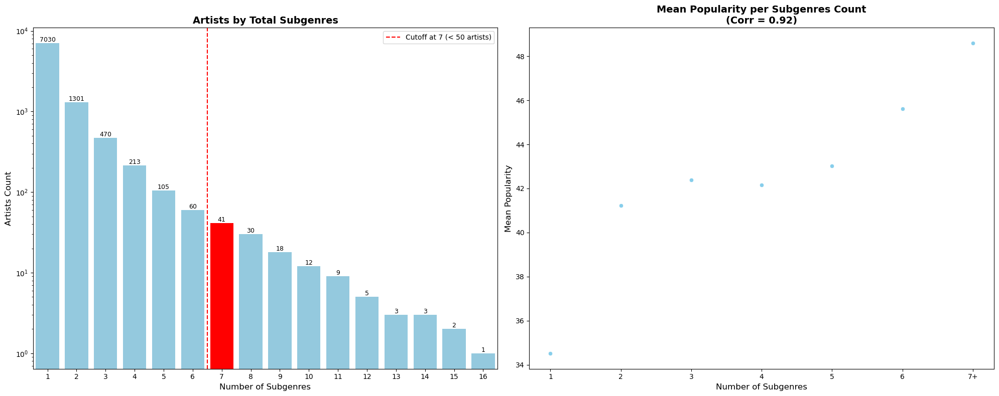
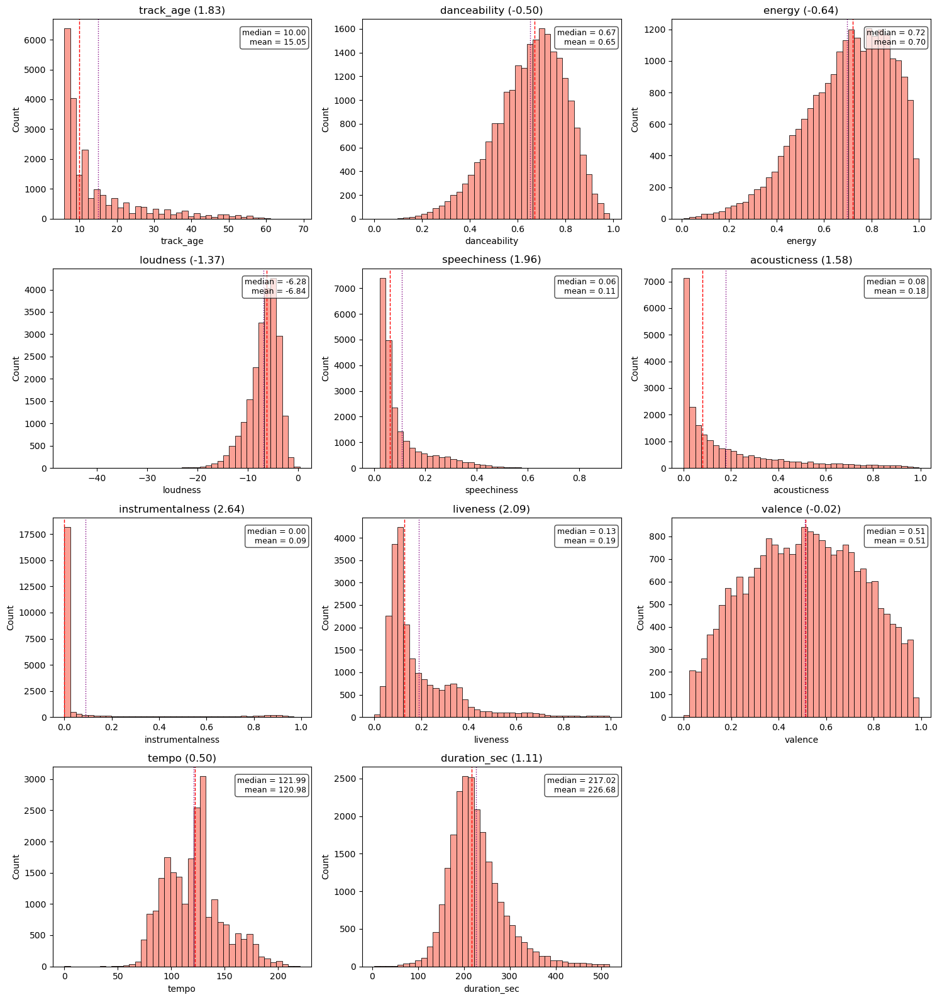
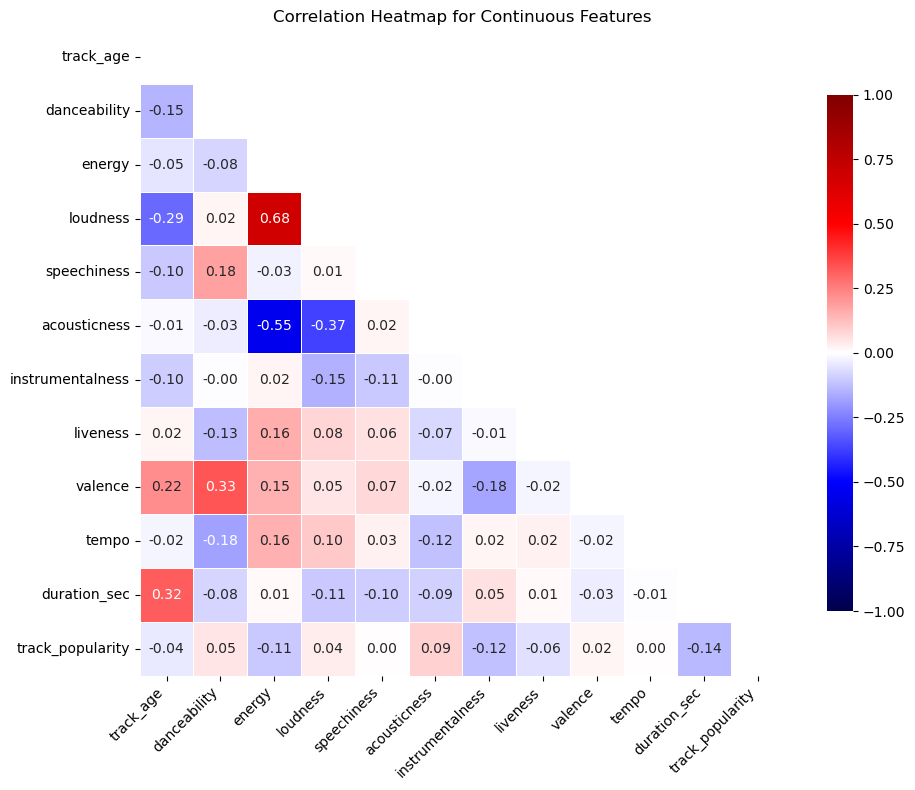
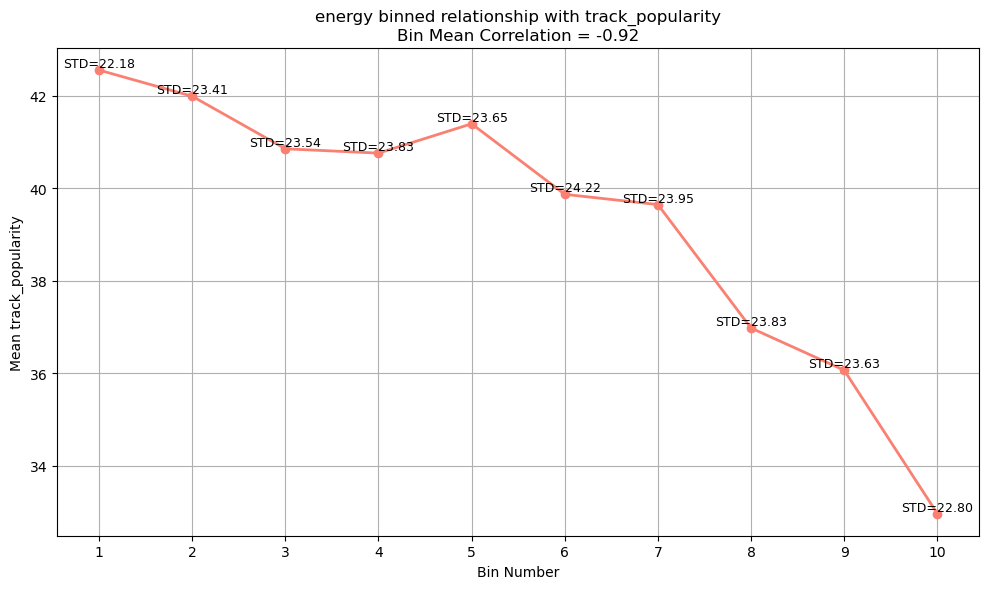
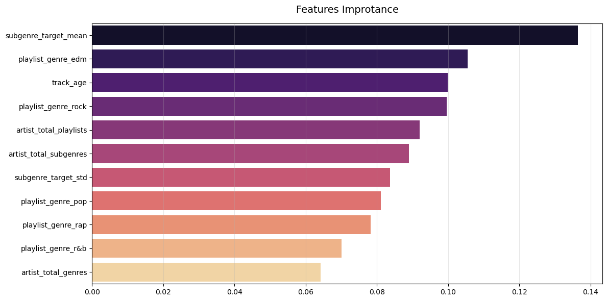
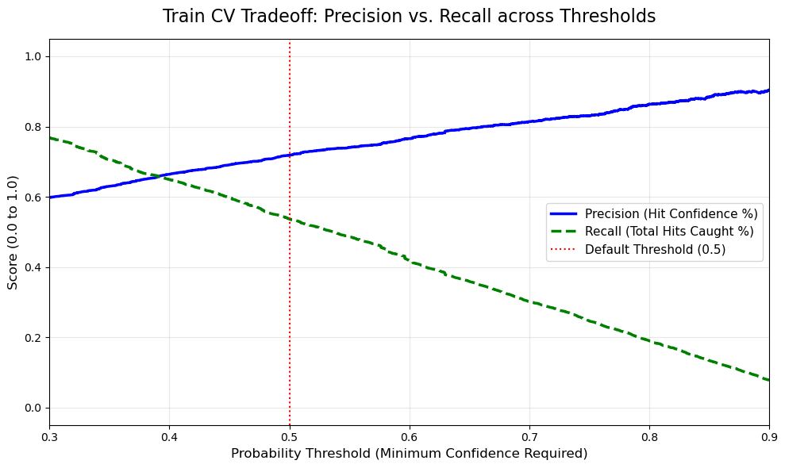
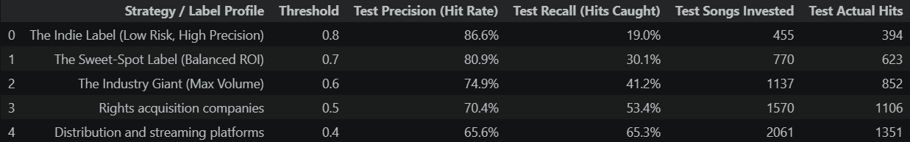

# Technical Documentation: Predicting Musical Hits on Spotify

---

## 1. Business Problem & Framing

### 1.1. The Business Imperative
The music industry is a high-stakes environment where identifying a "hit" song can generate immense revenue. Record labels and A&R (Artists and Repertoire) teams are constantly seeking to de-risk their investments in new artists and tracks. The central business problem this project addresses is: **Can we leverage data to predict the commercial success of a song before it is released?**

### 1.2. The Strategic Pivot from Regression to Classification
Initially, the project explored predicting the exact `track_popularity` score (a continuous value from 0 to 100) using a **regression** model. However, this approach presented two significant challenges:

1.  **Subjectivity and Noise:** A song's popularity score on Spotify is an algorithmic metric influenced by many transient factors. A score of 65 vs. 68 has little meaningful difference and can be subject to noise, making precise prediction difficult and potentially misleading.
2.  **Lack of Business Actionability:** For a record label, the key decision is categorical: "Is this a guaranteed hit, an average track, or a flop?" A predicted continuous score of 55 doesn't provide a clear, actionable answer.

To better align with the business need, the problem was reframed as a **multi-class classification** task. The target variable was clustered via **K-Means** into 3 distinct tiers: Flops (Class 0), Average (Class 1), and Hits (Class 2). This framing provides a direct, interpretable, and actionable output for stakeholders, allowing the business to isolate and target the top-tier "Hits" while remaining robust to the inherent noise in popularity metrics.

---

## 2. Data Preprocessing & Cleaning

A robust model is built on a foundation of clean, reliable data. The following steps were taken to prepare the dataset for analysis.

-   **Data Ingestion:** The initial dataset was loaded from `Data/spotify_songs_initial.xlsx`.
-   **Handling Duplicates:** The dataset contained duplicate entries for the same song (`track_id`) appearing in multiple playlists. These were handled by:
    -   Grouping the data by `track_id`.
    -   Aggregating categorical features like `playlist_genre` and `playlist_subgenre` into lists of unique values for each track.
    -   Taking the `first` observed value for all other numerical and metadata features, as they were consistent across duplicates.
-   **Dropping Irrelevant Columns:** Columns that offered no predictive value or were redundant were removed, including `track_name`, `playlist_name`, and `track_album_name`.
-   **Handling Missing Values:** A very small fraction of rows (0.014%) contained null values. Given the negligible amount, these rows were dropped to maintain data integrity without impacting the overall distribution.
-   **Data Type Conversion:** Columns like `duration_ms` were converted into more interpretable units (e.g., `duration_sec`).

---

## 3. Feature Engineering & Selection

This phase was critical for extracting maximum signal from the available data. The goal was to create features that capture not just the intrinsic qualities of a song but also its context within the music ecosystem.

### 3.1. Univariate Feature Creation
-   **`track_age`:** Calculated from `track_album_release_date` to analyze how a song's age correlates with its popularity.
-   **`duration_sec`:** Converted from milliseconds for easier interpretation.

### 3.2. Categorical Feature Strategy

A careful, multi-faceted strategy was employed for categorical features based on their cardinality and statistical properties.

-   **Low-Cardinality Features (`key`, `mode`):**
    -   **Rationale:** At first glance, the distribution of `track_popularity` appeared similar across different keys and modes. However, an **ANOVA (Analysis of Variance)** test was conducted to statistically test for differences in means.
    -   **Decision:** The test yielded a statistically significant p-value (`< 0.05`), indicating that the mean popularity *does* differ significantly across these categories. Therefore, both `key` and `mode` were retained as valuable predictive features.

-   **High-Cardinality Features (`playlist_subgenre`):**
    -   **Rationale:** The `playlist_subgenre` feature has high cardinality and, as EDA showed, a high variance in popularity within each subgenre. Simple one-hot encoding would be inefficient, and simple target encoding would miss the variance information.
    -   **Decision:** A hybrid encoding strategy was implemented within the cross-validation loop to prevent data leakage:
        -   **Target Mean Encoding:** Captures the average popularity for each subgenre.
        -   **Target Std Encoding:** Captures the standard deviation of popularity for each subgenre. This is crucial for tree-based models, as it allows them to learn how "reliable" the mean encoding is. A high STD signals that the subgenre is noisy and the model should weigh it less.

    

-   **Very High-Cardinality Features (`track_artist`, `track_album_id`):**
    -   **Rationale:** These features exhibit a long-tail distribution, where most artists and albums appear only once. Applying target encoding directly to these features would be equivalent to leaking the target variable into the model, leading to **severe overfitting**. The model would simply memorize that a specific song from the training set was a hit, rather than learning generalizable patterns.
    -   **Decision:** To avoid this critical pitfall, a deliberate choice was made to **EXCLUDE** target encoding for `track_artist` and `track_album_id`. Instead, these features were used to engineer higher-level "artist reach" aggregations, which proved far more robust (e.g., `artist_total_playlists`, `artist_total_genres`).

    

---

## 4. Exploratory Data Analysis (EDA)

EDA provided crucial insights into the data's structure and informed the feature engineering and modeling strategies.

### 4.1. Univariate Analysis
The analysis of individual feature distributions revealed key patterns:
-   **Normally Distributed:** Features like `danceability` and `valence` showed a balanced, normal distribution.
-   **Skewed Distributions:** `track_age`, `acousticness`, and `liveness` were highly right-skewed, indicating a dataset dominated by newer, non-acoustic, studio-recorded tracks. `energy` and `loudness` were left-skewed.
-   **Zero-Inflated:** `instrumentalness` was heavily concentrated at or near zero, confirming that most tracks contain vocals.

*(Caption: Distribution of key continuous audio features, highlighting skewness and central tendencies.)*

### 4.2. Bivariate and Correlation Analysis
-   **Strong Correlations:** A strong positive correlation was observed between `energy` and `loudness` (0.68), which is intuitive. A notable negative correlation was found between `energy` and `acousticness` (-0.55).
-   **Binned Analysis:** Although linear correlations with the target were weak, binning continuous features into quantiles and plotting the mean popularity revealed clear monotonic and non-linear trends. For instance, `danceability` and `energy` showed a positive trend with popularity.

*(Caption: Heatmap showing Pearson correlations between continuous features.)*

*(Caption: Mean track popularity across quantiles of continuous features, revealing non-linear relationships.)*

---

## 5. Outlier Detection

-   **Algorithm:** The **Isolation Forest** algorithm was employed to detect and remove multi-dimensional outliers from the training set.
-   **Rationale:** Unlike distance-based methods, Isolation Forest is a tree-based algorithm that is robust to non-linear relationships and does not require feature scaling. It effectively isolates anomalies by identifying data points that require fewer splits to be separated from the rest, making it ideal for the complex structure of audio features. A contamination rate of 2% was used as a safe starting point.

---

## 6. Modeling & General Evaluation

### 6.1. Model Selection
A suite of models was trained to evaluate different approaches to the classification task:
1.  **Logistic Regression:** Served as a strong, interpretable baseline model.
2.  **K-Nearest Neighbors (KNN):** A distance-based model to capture local patterns.
3.  **XGBoost Classifier:** A powerful gradient boosting model known for its performance and ability to capture complex, non-linear interactions between features.

### 6.2. Holistic Evaluation
The initial models were evaluated using `f1_macro` to ensure balanced performance across all three classes (Flop, Average, Hit). The XGBoost Classifier significantly outperformed the others, establishing it as the best candidate for the final production model.

*(Caption: SHAP or permutation feature importance plot for the final model, highlighting the top predictors of a hit song.)*

---

## 7. The ML Layer: Production Model & Optimization

After establishing XGBoost as the superior algorithm, the focus shifts from general performance to a targeted business goal. The objective is to build a production-ready model optimized to **precisely identify "Hits" (Class 2)**, as falsely promoting a "flop" or an "average" track is a costly business error.

### 7.1. Threshold Optimization for Precision
A standard classifier uses a default probability threshold, but this is rarely optimal for a specific business need. To maximize the precision of identifying Class 2 "Hits", we analyzed the **Precision-Recall Curve** using **Out-Of-Fold (OOF)** predictions. This technique prevented data leakage by generating unbiased probabilities on the training set. This allowed us to find the ideal probability threshold that correctly identifies a high percentage of true hits while strictly minimizing the number of false positives.

*(Caption: Precision-Recall curve used to identify the optimal probability threshold for maximizing the precision of "Hit" predictions.)*

### 7.2. Final Model Performance
Using the optimized thresholds, the final XGBoost model was evaluated on the unseen test set. The results demonstrate a model that is not only statistically robust but also aligned with the core business objective of confidently identifying commercially successful tracks.

---

## 8. The Business Layer: Strategic Implementation

The true value of a machine learning model lies in its application. This section outlines how the technical output of the ML Layer is translated into an actionable strategic framework for A&R teams. This is achieved through a `BusinessModel` that wraps the production-ready classifier.

### 8.1. The Artist & Track Scorecard
Instead of just providing a raw predicted class, the business model generates a human-readable **Scorecard** for any given track. This scorecard includes:
-   **Predicted Class:** A clear label based on target thresholds (e.g., "Safe Bet," "Hidden Gem").
-   **Hit Probability:** The precise probability score calculated for the song belonging to Class 2 (Hit).
-   **Key Driving Factors:** A list of the top positive and negative features that influenced the prediction (derived from feature importances or SHAP values). This provides the "why" behind the model's decision, making it transparent and trustable for A&R professionals.

### 8.2. Strategic Tiers for Decision-Making
The model's Class 2 probability scores are segmented into four distinct strategic tiers, each with a clear business action:

-   **Safe Bets (Class 2 Probability > 85%):**
    -   **Description:** Tracks with exceptionally high confidence of becoming a hit. These songs align perfectly with known success patterns.
    -   **Business Action:** **Prioritize for high investment.** These are strong candidates for major promotional campaigns and immediate signing.

-   **Calculated Risks (50% < Class 2 Probability < 85%):**
    -   **Description:** Songs with solid hit potential but may lack one or two key drivers. They show promise but are not guaranteed successes.
    -   **Business Action:** **Forward to A&R for qualitative review.** Use the Scorecard's driving factors to guide expert human evaluation.

-   **Hidden Gems (20% < Class 2 Probability < 50%):**
    -   **Description:** These tracks are classified as "non-hits" mathematically but still retain a non-trivial probability of success. They often represent niche, emerging, or unconventional artists who possess some, but not all, characteristics of a mainstream hit.
    -   **Business Action:** **Monitor and nurture.** This is the tier for discovering undervalued talent. The label can track these artists, offer developmental deals, or wait for more market signals before making a larger investment.

-   **Low Priority (Class 2 Probability < 20%):**
    -   **Description:** Tracks with a very low probability of commercial success.
    -   **Business Action:** **Safe to ignore.** This allows the A&R team to efficiently filter out the vast majority of submissions and focus their time and resources on higher-potential tracks.

---

## 9. Conclusion & Final Recommendations

This project successfully transitioned from a noisy regression problem to a robust, business-aligned 3-tier classification system. The final XGBoost model, when optimized for Class 2 Precision and integrated into a flexible strategic business framework, provides a powerful tool for de-risking investment decisions in the music industry.

**Final Recommendation:**
It is recommended to deploy this two-layered system (ML production model + Business layer) as a core component of the A&R workflow. By leveraging the data-driven Scorecards and customizable Strategic Tiers, a record label can enhance its ability to identify high-potential artists, allocate marketing resources more effectively, and gain a significant competitive advantage in the search for the next musical hit.